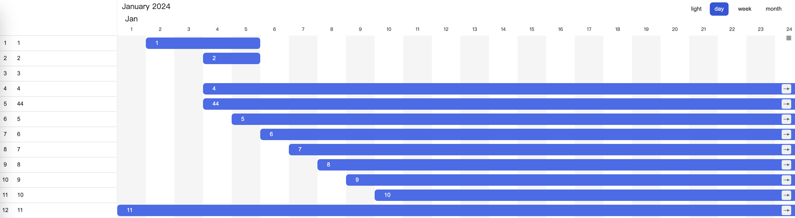
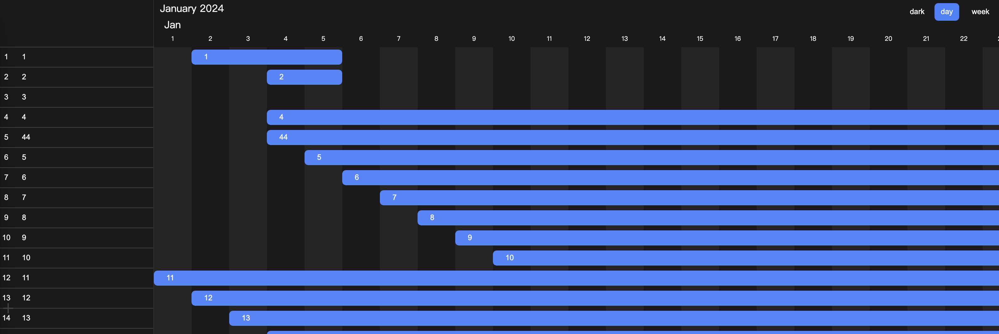
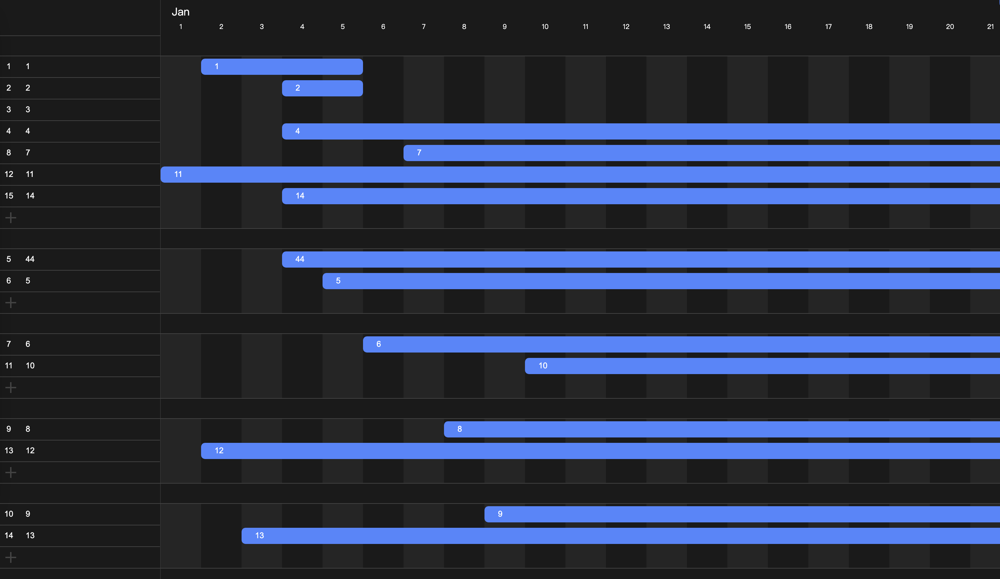
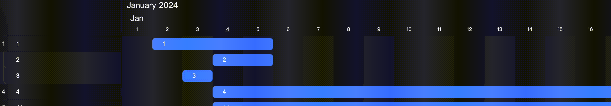
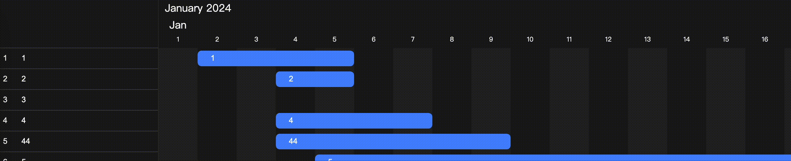
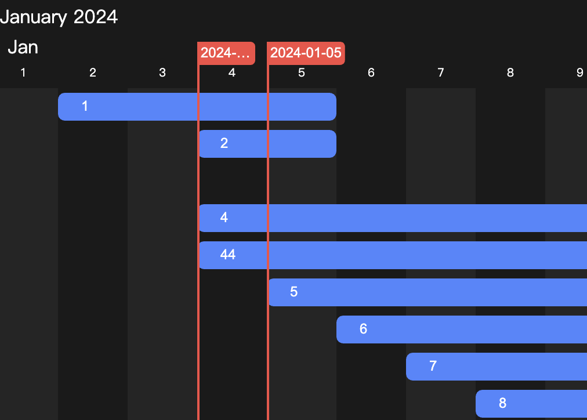

# Konva-Gantt
A Gantt component based on Konva and Vue.**Is still in the early stage of development**
## Features
### View mode
Support multiple view modes: `day` `week` `month`.
```ts
type GanttViewMode = 'year' | 'month' | 'week' | 'day';

store.viewConfig.mode = 'day';
```
### Theme mode
Support light and dark theme
```ts
export type GanttTheme = 'light' | 'dark';

store.viewConfig.theme = 'light';
```
light theme

dark theme

### High Performance
Frame rate with 10k blocks.


### Multiple data structes
Group and list
```ts
export interface GanttDataBlock {
  ...
  groupKey?: string;
}
```


Parent and child
```ts
export interface GanttDataBlock {
  ...
  parentKey?: string;
}
```
If have a parent node, the operation of the change date will be limited by the parent's date.

### Custom features
Add custom features is very simple, just wirte in `setupGantt` function
```ts
setupGantt(() => {
  useCustomFeature();
})
```
In `useCustomFeature`
```ts
import {
  useAssembleInput, useHook, useStore,
} from '@konva-gantt/core';

function useCustomFeature() {
  useStore();
  useAssembleInput();
  useHook();
}
```
There are some hooks and decorators for custom features.
#### useStore
Used to access Gantt data.

#### useAssembleInput
Used to add custom nodes to the internal node.

```ts
  useAssembleInput<GanttCell>(GanttCell.Name, (cellGantt: GanttCell) => {
    return {
      mount(){},
      updte(){},
      unmount(){},
    }
  });
```

#### useHook
Used to listen to the internal hooks.
```ts
useHook('changeBlockTime', (key, startTime, endTime) => {});
```
#### @GanttEffectComponent
The basic decorator for Gantt component. Every component that uses store should add `@GanttEffectComponent`.
```ts

@GanttEffectComponent(useStore)
export class GanttComponent {
  declare store: GanttStore;
  ...
}
```
#### @GanttEffectUpdate
**require `@GanttEffectComponent` Decorator**
Decorator for optimizing component render, just like Vue component render logic.
For example
```ts
@GanttEffectComponent(useStore)
export class ParentComponent {
  declare store: GanttStore;

  child: ChildComponent;
  
  update() {
    child.update();
  }
}

@GanttEffectComponent(useStore)
export class ChildComponent {
  declare store: GanttStore;

  width: ref(0);
  
  @GanttEffectUpdate()
  update() {
    node.width(this.width.value);
  }
}
```
If `ChildComponent` without `@GanttEffectUpdate`, when `width` property changes, `parent.update` will also exec.
#### @ComputedGet
Convert class property to Vue compute.
## Internal custom features
### Constraint


### Milestone


## Development
### Install
```bash
git clone https://github.com/Senasiko/konva-gantt.git
```
### Run dev
1. `pnpm i`
2. `pnpx turbo dev`
